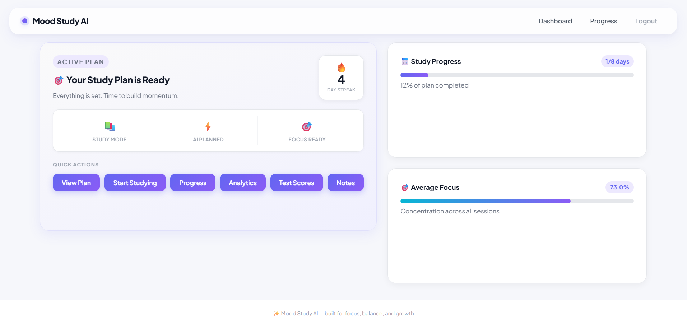
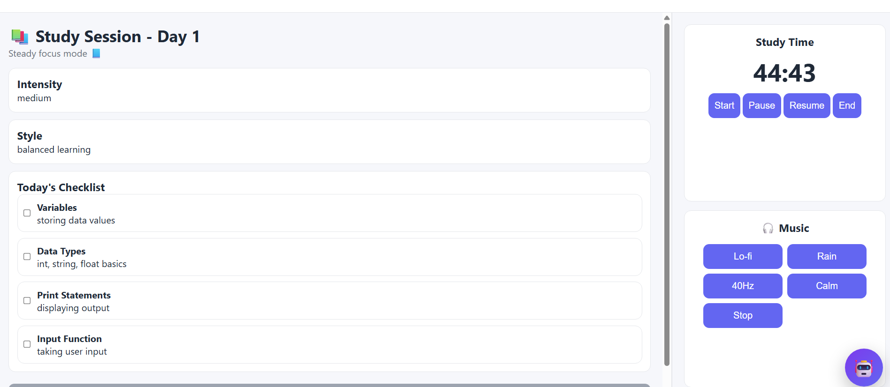
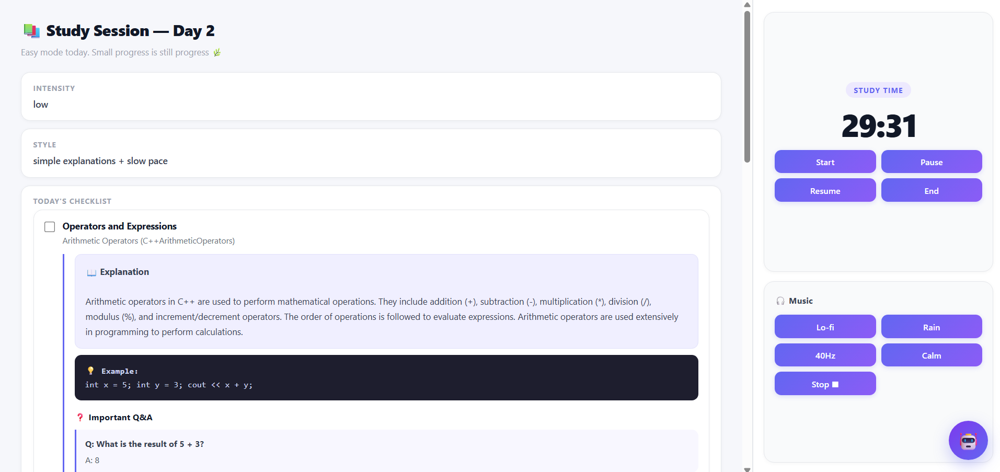
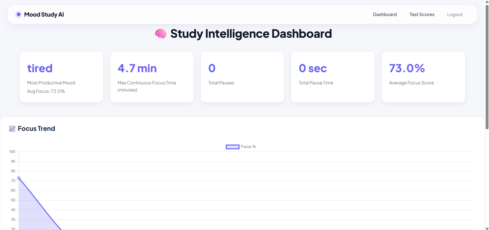
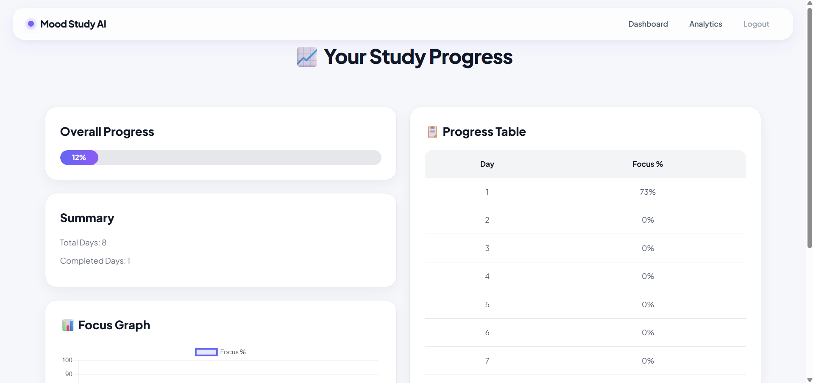
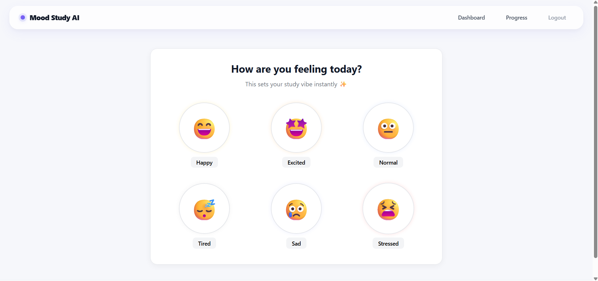

# Mood Study AI

AI-powered personalized study planner that adapts to your mood, focus, and learning pace.

---

## ✨ Features

* 📚 AI-generated personalized study plans
* 😊 Mood-based study adaptation
* 🤖 AI Tutor with explanations and MCQs
* 🎯 Focus score tracking system
* 📈 Study analytics and progress tracking
* 📝 Smart notes system
* 🧪 Test score management
* 🔥 Streak tracking and motivation
* 🎵 Focus study sessions with ambient music
* 💎 Modern and responsive UI

---

## 🚀 Why Mood Study AI?

Most students struggle with:

* inconsistent focus
* burnout
* overwhelming syllabi
* lack of personalized guidance

Mood Study AI helps students study smarter by combining AI planning, mood analysis, focus tracking, and interactive learning into one platform.

Instead of following rigid schedules, students get a study system that adapts to their energy, emotions, and productivity.

---

## 🛠️ Tech Stack

* Python
* Flask
* HTML
* CSS
* JavaScript
* SQLite
* Jinja2
* Groq API

---

## 📸 Main Features

### 📅 AI Study Planner

Upload a syllabus PDF or paste syllabus text and automatically generate a personalized day-wise study plan.

### 🤖 AI Tutor

Generate:

* explanations
* examples
* MCQs
* revision content

for every topic using AI.

### 📈 Progress & Analytics

Track:

* completed study days
* focus percentage
* productivity trends
* study consistency

### 📝 Notes System

Save and organize important study notes directly inside the platform.

### 🎯 Focus Score

Mood Study AI calculates focus score using:

* pauses
* study streak
* consistency
* session behavior

to help students improve concentration habits.

---

## ⚡ Installation

```bash
git clone https://github.com/aarushbhardwaj027-pixel/MoodStudyAI.git

cd MoodStudyAI

pip install -r requirements.txt

python app.py
```

---

## 🔑 Environment Variables

Create a `.env` file:

```env
GROQ_API_KEY=your_api_key_here
SECRET_KEY=your_flask_key
```

---

## 👨‍⚖️ Demo Account

For hackathon judges/demo purposes:

```text
Email: demo@gmail.com
Password: demo123
```

---

## 🧠 Challenges Faced

One of the biggest challenges was handling AI API reliability and token limitations during development.

Different AI providers produced:

* formatting issues
* quota errors
* unstable outputs
* inconsistent response structures

After experimenting with multiple AI providers and models, the project was optimized using Groq APIs for faster and more stable responses.

Another challenge was designing a meaningful focus score system that actually reflects student productivity rather than simple timer tracking.

---

## 🌟 Future Improvements

* Mobile application version
* Smarter AI recommendations
* Cloud sync
* AI voice tutor
* Better productivity analytics
* Real-time collaborative study rooms

---

## 🏆 Hackathon Track

This project fits perfectly in the **AI Tools for Student Life** category because it uses AI to simplify planning, studying, revision, and productivity management for students.

---

## 📹 Demo

Demo video and screenshots included in hackathon submission.

---

## 💙 Built With Passion

Built to make studying less stressful, more personalized, and more motivating for students.

## Screenshots

# Dashboard


# Study Session



# Analytics


# Progress


# mood

